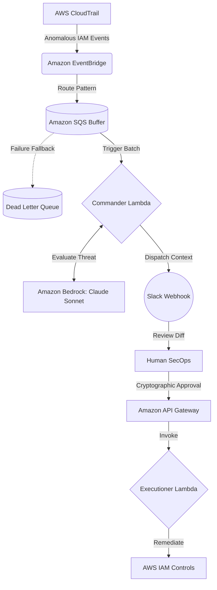

# Agentic-NHI: Event-Driven AWS Security Orchestrator

A Go-based, event-driven security engine that detects rogue Non-Human Identities (NHI) using AWS CloudTrail and Amazon Bedrock, triggering an interactive Slack-based kill-switch for immediate quarantine.

---

## 💡 Why I Built This

Non-Human Identities (like service accounts, IAM users used by scripts, or CI/CD pipelines) are high-value targets for attackers. When an AWS access key is leaked, hours can pass before a security team detects and manually deactivates it. 

I built **Agentic-NHI** to solve this response-time problem. It's a decoupled, zero-trust system that:
1. Listens to high-risk IAM events across AWS regions.
2. Uses Bedrock (Claude Sonnet) to analyze the event payload for anomalous behavior.
3. Automatically alerts SecOps in Slack with a "One-Click Deactivate" interactive button.
4. Quarantines the compromised credentials immediately upon approval.

---

## 🏗️ Architecture & Data Flow



### System Breakdown:
1. **Ingress & Queuing:** CloudTrail captures IAM API calls. EventBridge forwards global IAM events to a regional EventBus, which pushes them to an SQS queue. This queue buffers events to prevent rate-limiting or drop-offs during traffic spikes.
2. **The Analysis Plane:** The [Commander Lambda](file:///Ubuntu/home/nathan/agentic-nhi/cmd/commander/main.go) processes SQS events. It uses Amazon Bedrock to run a zero-trust threat evaluation on the raw CloudTrail JSON.
3. **Human-in-the-Loop (Slack):** If Bedrock flags the event as rogue, the Commander sends an interactive Block Kit message to Slack.
4. **The Execution Plane:** SecOps approval triggers a callback to API Gateway. The Gateway validates the webhook payload and invokes the isolated [Executioner Lambda](file:///Ubuntu/home/nathan/agentic-nhi/cmd/executioner/main.go) to deactivate the compromised IAM key.

---

## 📈 System Evolution & Engineering Trade-offs

A major focus of this project was refactoring it from a simple prototype into a resilient, production-ready system. Here are the core architectural decisions I made:

### 1. From Synchronous to Eventual Consistency (SQS Load-Leveling)
* **The Problem:** In my first version, EventBridge invoked the Lambda function directly. During load testing (simulating a credential stuffing attack), the sheer volume of telemetry events caused database write-throttling and dropped alerts.
* **The Solution:** I decoupled the ingestion layer using **Amazon SQS** as a buffer, backed by a **Dead-Letter Queue (DLQ)**. This load-leveling pattern handles massive traffic spikes gracefully without losing a single alert.

### 2. Privilege Separation (Commander vs. Executioner)
* **The Problem:** Initially, a single monolithic Lambda role had permissions to both invoke Bedrock and update IAM keys. If the logic plane got compromised, the attacker would have full write access to my AWS accounts.
* **The Solution:** I split the application into two binaries with separate, highly-scoped roles:
  * **Commander:** Read-only access to SQS and Bedrock.
  * **Executioner:** Write-only access to deactivate IAM keys (`iam:UpdateAccessKey`).

---

## 🔍 Security Audit & Backlog (Red Team Review)

In the spirit of honest, zero-trust engineering, I conducted a threat modeling and code audit on this pipeline. I'm currently tracking and fixing these architectural issues in my backlog:

* **Webhook Authentication:** The [Executioner Lambda](file:///Ubuntu/home/nathan/agentic-nhi/cmd/executioner/main.go) webhook is open to the internet. I am adding Slack signature verification (`X-Slack-Signature` and `X-Slack-Request-Timestamp`) to prevent unauthenticated actors from spoofing callbacks.
* **Scope Reduction:** The Executioner role currently allows updating access keys on `arn:aws:iam::*:user/*`. I am working to narrow this to prevent deactivating critical administrative roles.
* **OIDC CI/CD Polish:** The GitHub Actions workflow authenticates securely via AWS OIDC (no long-lived keys), but uses `AdministratorAccess`. I am refactoring [lambda.tf](file:///Ubuntu/home/nathan/agentic-nhi/infra/lambda.tf) to use a custom, least-privileged role for Terraform deployments.

---

## 🛠️ Tech Stack

* **Language:** Go 1.26 (Statically built for `linux/arm64` Lambda runtime)
* **Infrastructure:** HashiCorp Terraform (100% Infrastructure as Code)
* **AWS Services:** Lambda (provided.al2023), SQS, API Gateway (HTTP API), EventBridge, IAM
* **AI/LLM:** Amazon Bedrock (Anthropic Claude Sonnet)

---

## 🚀 How to Build & Deploy

### 1. Build the Binaries
```bash
# Build the Commander Lambda
GOOS=linux GOARCH=arm64 go build -o bin/commander/bootstrap cmd/commander/main.go

# Build the Executioner Lambda
GOOS=linux GOARCH=arm64 go build -o bin/executioner/bootstrap cmd/executioner/main.go
```

### 2. Deploy Infrastructure
```bash
cd infra
terraform init
terraform apply -var="slack_bot_token=xoxb-..." -var="slack_channel_id=C..."
```
