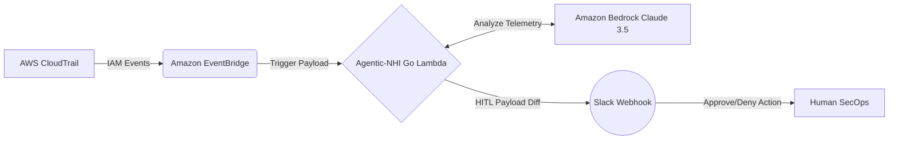

# Agentic-NHI Commander

An event-driven AWS security orchestrator in Go that analyzes CloudTrail IAM activity using Amazon Bedrock and routes high-risk anomalies into a Slack-based Human-in-the-Loop (HITL) approval workflow.

## 🏗 Architecture & Flow Diagram

### The Data Flow
1. **Ingress:** AWS CloudTrail captures IAM activity (e.g., `CreateUser`, `AttachRolePolicy`).
2. **Event Routing:** Amazon EventBridge filters high-risk events and triggers the Commander Lambda.
3. **Reasoning Engine:** The Go binary reconstructs the event context and queries Amazon Bedrock (Claude 3.5 Sonnet) to determine the malicious intent or blast radius of the action.
4. **Human-in-the-Loop:** If the AI determines the action is anomalous, it pushes an interactive Block Kit payload to a secure Slack channel for immediate SecOps approval/denial.

## 🧩 Detection Logic

Anomalous behavior is defined by IAM activity deviating from expected execution baselines. The system combines structured heuristics with model-assisted classification to assess risk.

Examples of flagged patterns include:
- Privileged actions (e.g., `AttachUserPolicy`, `CreateAccessKey`) executed outside approved CI/CD roles
- High-frequency API calls across multiple regions within short time intervals, indicating potential automated reconnaissance
- IAM role or policy modifications not associated with known infrastructure workflows

The Bedrock model is used to enrich context and assist classification, while final authorization decisions are enforced through a human-in-the-loop (HITL) approval process.

## 🛠 Tech Stack
* **Core Application:** Go (1.22)
* **Infrastructure as Code (IaC):** HashiCorp Terraform
* **Cloud Provider:** Amazon Web Services (AWS)
* **Compute & Security:** AWS Lambda, IAM (Least-Privilege Execution)
* **AI/ML:** Amazon Bedrock (Claude 3.5 Sonnet)
* **CI/CD:** GitHub Actions (Zero-Trust OIDC Federation)

## 🔒 Security Posture & DevSecOps

This project adheres to strict enterprise security standards:
* **Zero-Trust Deployment:** The GitHub Actions pipeline does **not** use long-lived AWS Access Keys. It relies entirely on an OpenID Connect (OIDC) bridge, requesting temporary, short-lived STS tokens for Terraform deployments.
* **Ephemeral Compute:** The Go binary runs in a transient AWS Lambda environment, meaning there are no permanent servers to patch or expose to edge vulnerabilities.
* **Least-Privilege IAM:** The Lambda execution role only contains the exact `bedrock:InvokeModel` and `logs:PutLogEvents` permissions required to operate.
* **Secret Management:** Slack OAuth tokens are injected securely at runtime via Terraform variables mapped to GitHub Actions encrypted secrets.

## 🚀 Deployment Pipeline

The infrastructure is fully automated. Pushing to the `main` branch triggers the GitHub Actions workflow, which:
1. Provisions an Ubuntu runner.
2. Cross-compiles the Go application for `linux/arm64`.
3. Assumes the AWS OIDC deployment role.
4. Executes `terraform init` and `terraform apply` to synchronize the cloud state.

## 🚧 Current Bottlenecks & Roadmap
* **DynamoDB State Contention:** Currently encountering state-lock contention during high-volume EventBridge floods when attempting to track asynchronous remediation states.
* **MCP Migration:** Evaluating a migration to a pull-based MCP (Model Context Protocol) server architecture to eliminate the database middleware entirely and directly route AWS telemetry to the Claude 3.5 context window.
* **Lambda wildcard fix:** Attempting to fix executioner lambda with wildcard in future will remove to adhere to least privilege execution role

## Current Engineering Focus: State-Lock Mitigation

Currently refactoring the event-driven ingest pipeline to handle high-velocity telemetry floods. I am actively benchmarking the architectural trade-offs between two state-management models:

* **Distributed Eventual Consistency:** Utilizing standard message queues for load-leveling to prevent downstream database write-throttling.
* **Strict ACID Compliance:** Enforcing row-level locking via a relational database to eliminate race conditions and guarantee deterministic state updates during concurrent execution.